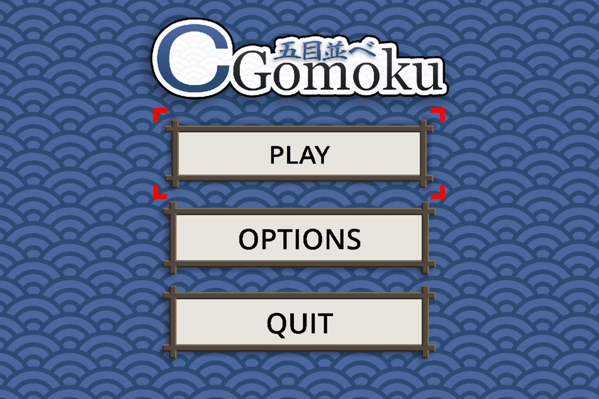

<p align="center">
  
</p>

# CGomoku

An opensource game of [Gomoku] made in pure C and [SDL2]. Made as an university assignment for a C course. Enjoy!

<p align="left">
  
</p>

## Overview

CGomoku (otherwise known as *Five in a Row*) is a two player strategy game played on a 15x15 grid. 

> TODO: Add Project overview and How-To-Play sections 

## Building & Compiling From Source

CGomoku uses [CMake] (ver. 3.12+) as its build system.

- Clone this repo:
  ```console
  git clone https://github.com/hhimko/CGomoku
  cd CGomoku
  ```

- Install all the [dependencies].

- Make a build folder:
  ```console
  mkdir build && cd build
  ```

- Build the project with cmake:
  ```console
  cmake ..
  make
  ```

The executable is called `Gomoku` and should be under `/build/bin`.


## Dependencies

CGomoku uses no more than the `SDL2` library, along with two of its extension libraries: `SDL2 TTF` and `SDL2 Mixer`.

### Installing SDL2
  - Under **Ubuntu**/**Debian** based distributions run: 
    ```console
    sudo apt-get install libsdl2-dev libsdl2-ttf-dev libsdl2-mixer-dev
    ```

  - Under **MacOS** run:
    ```console
    brew install sdl2 sdl_ttf sdl2_mixer
    ```
    
  - Under **Windows**:
    1. Download the latest releases of [SDL2-devel], [SDL2-ttf] and [SDL2-mixer] for either VC or MinGW.
    2. Extract the downloaded files to `CGomoku/include`.
    3. Change the extracted directory names from `SDL2-x.x.x` to `SDL2`, `SDL2_ttf-x.x.x` to `SDL2_ttf` and `SDL2_mixer-x.x.x` to `SDL2_mixer`.

  For other OSs please refer to [SDL Wiki's Installation Guide].


## License

CGomoku is licensed under the [MIT License].
All game assets and sound effects were created by the author for the purpose of this project.

Author: Dawid Cyganek [@hhimko]


[Gomoku]: https://en.wikipedia.org/wiki/Gomoku
[SDL2]: https://www.libsdl.org/
[SDL Wiki's Installation Guide]: https://wiki.libsdl.org/Installation
[CMake]: https://cmake.org/
[SDL2-ttf]: https://github.com/libsdl-org/SDL_ttf/releases
[SDL2-mixer]: https://github.com/libsdl-org/SDL_mixer/releases
[SDL2-devel]: https://github.com/libsdl-org/SDL/releases
[dependencies]: #dependencies
[MIT License]: https://opensource.org/licenses/MIT
[@hhimko]: https://github.com/hhimko
